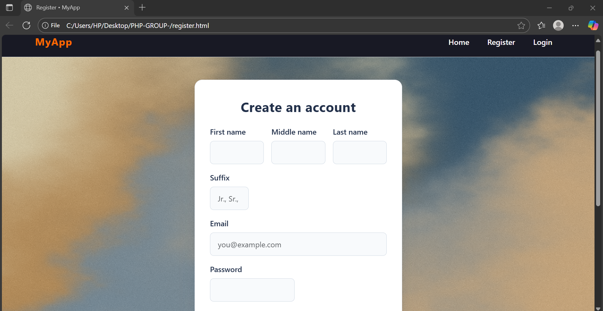
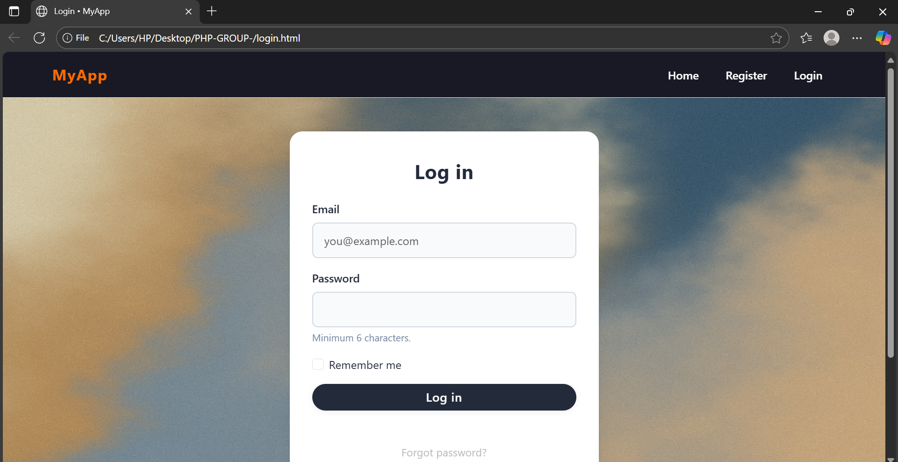
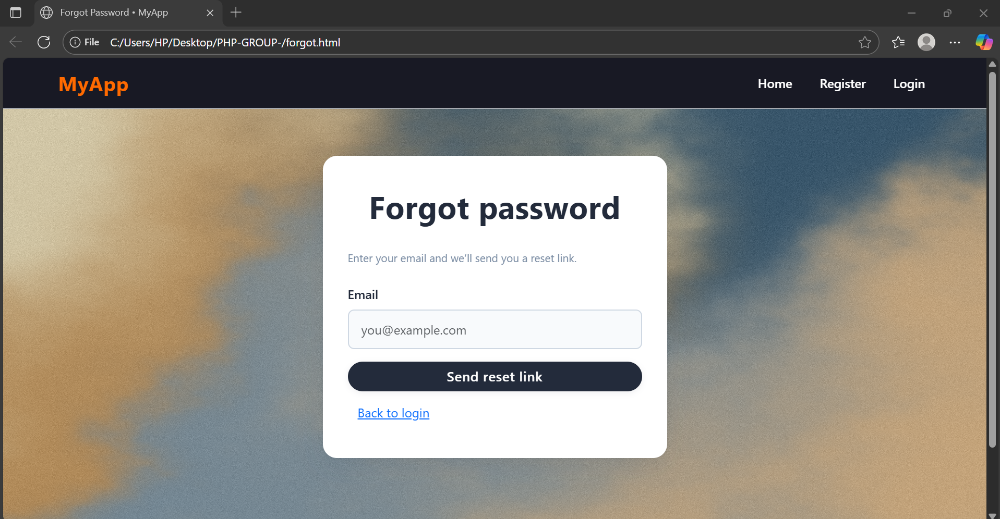
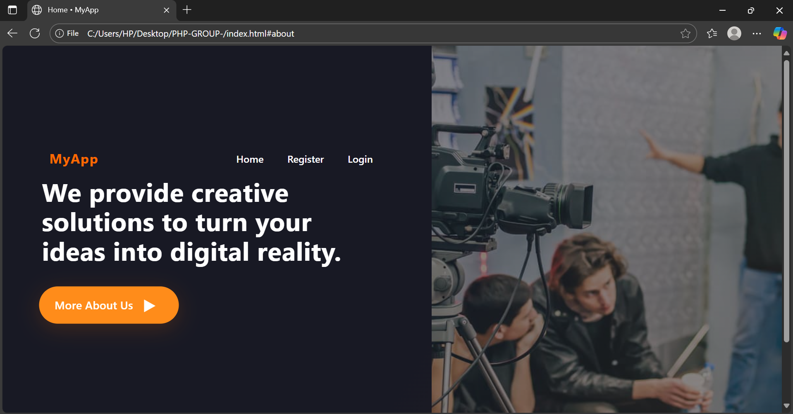

Title : Digital Asset Access & Expiry Management System.

Project Overview :
       A PHP web portal that lets businesses securely upload, organize, and share digital files (PDFs, images, videos, ZIPs, etc.) using time-limited access links, download limits, and audit logging.

Group Members : Munez Dave, Bragat Carl, Nuega Mari Angelo

 

## Screenshots

### Registration Page

### Login Page

### Forgot Password Page

